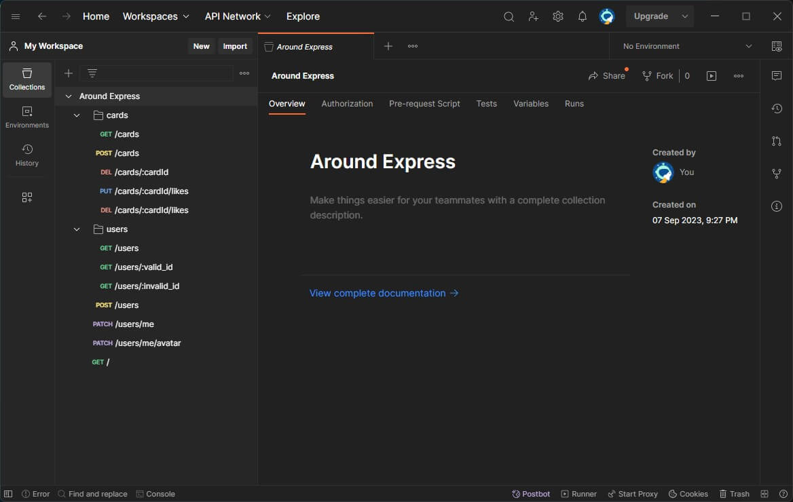
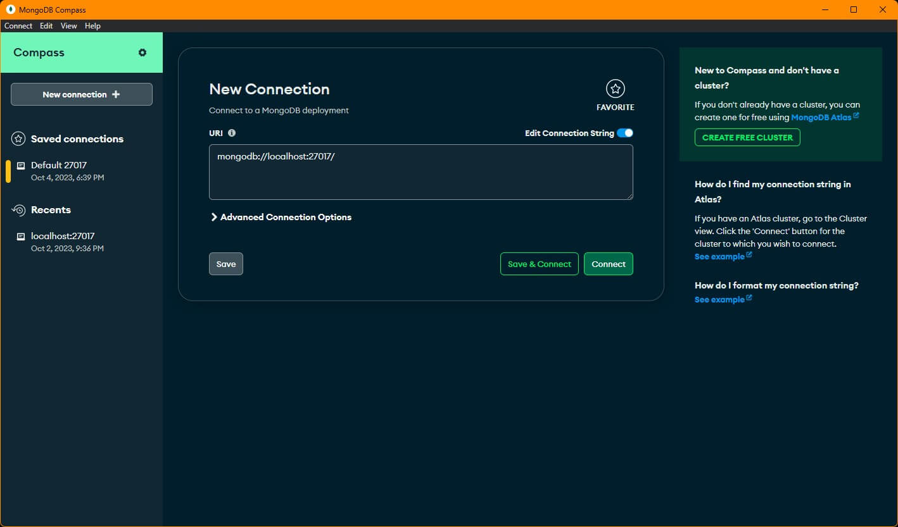
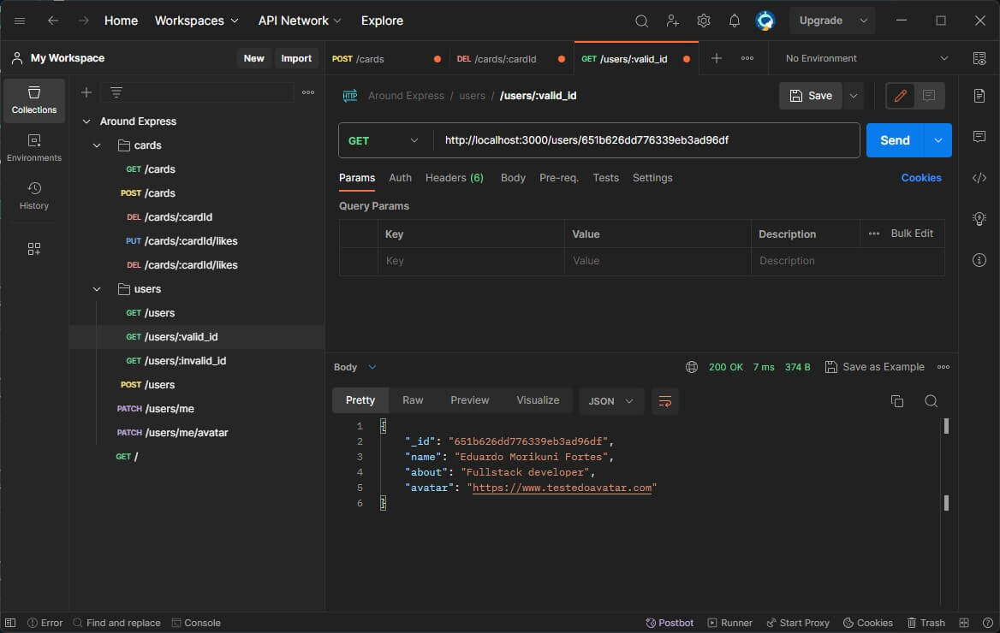
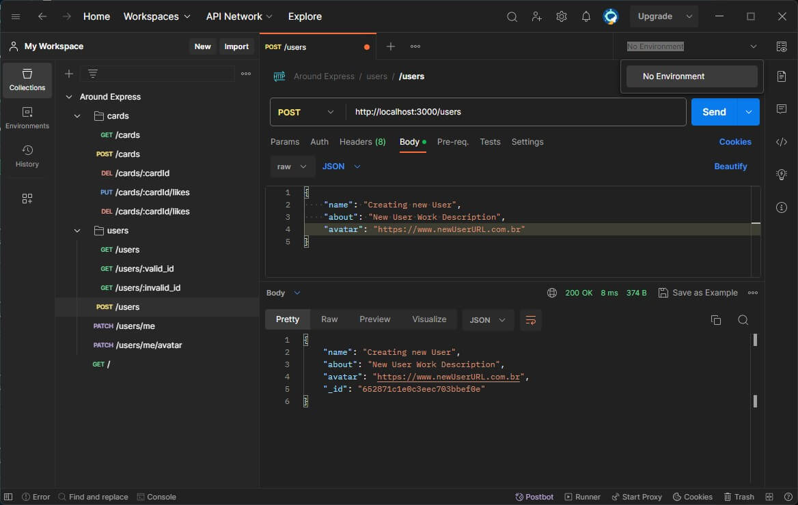
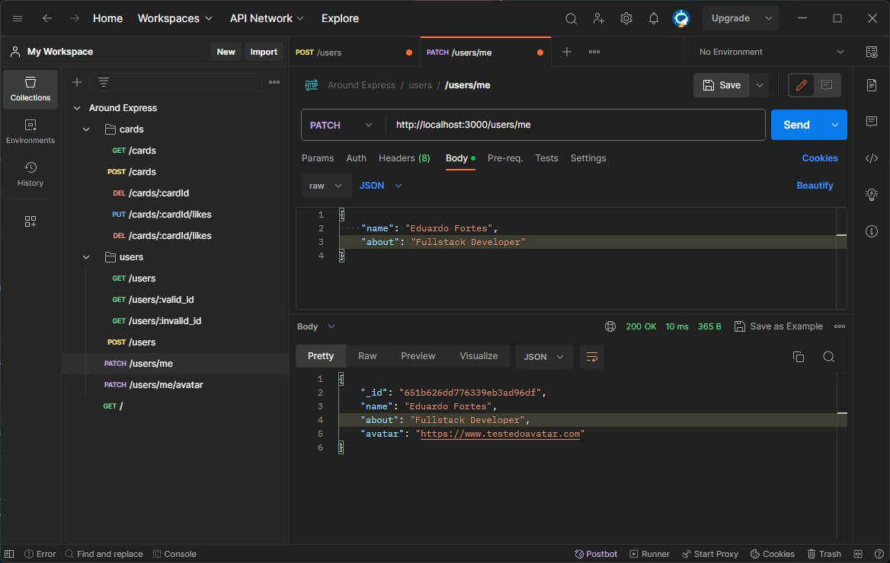
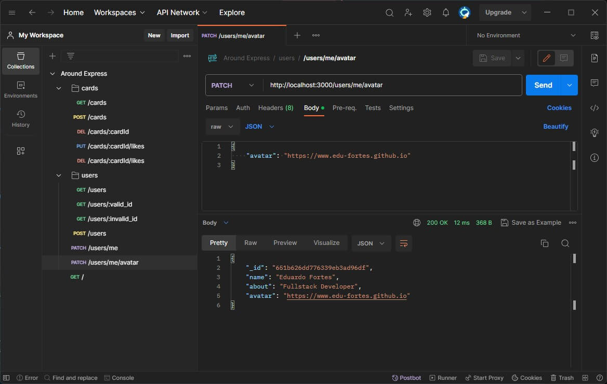
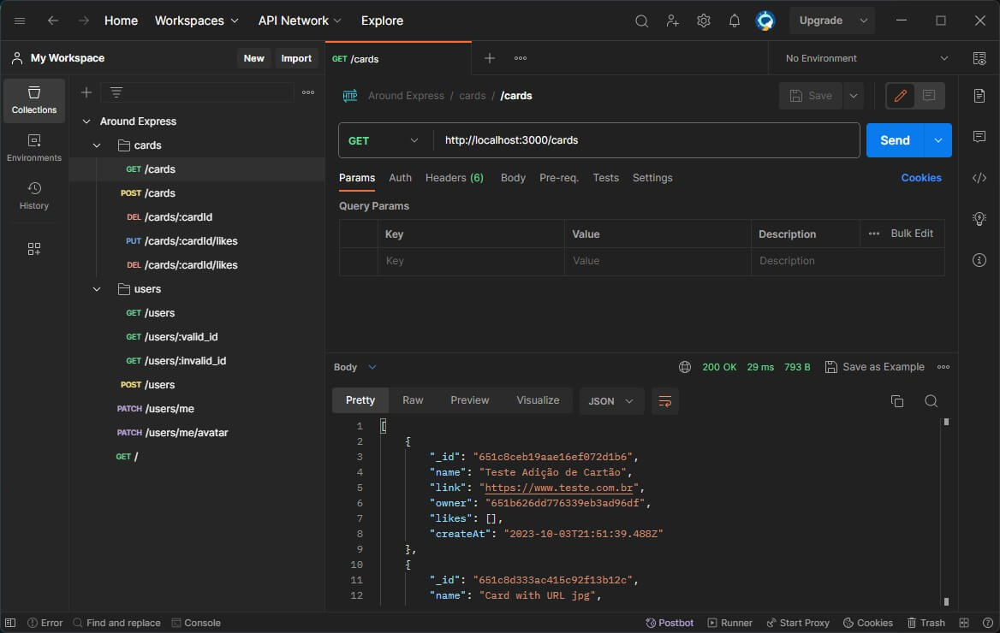
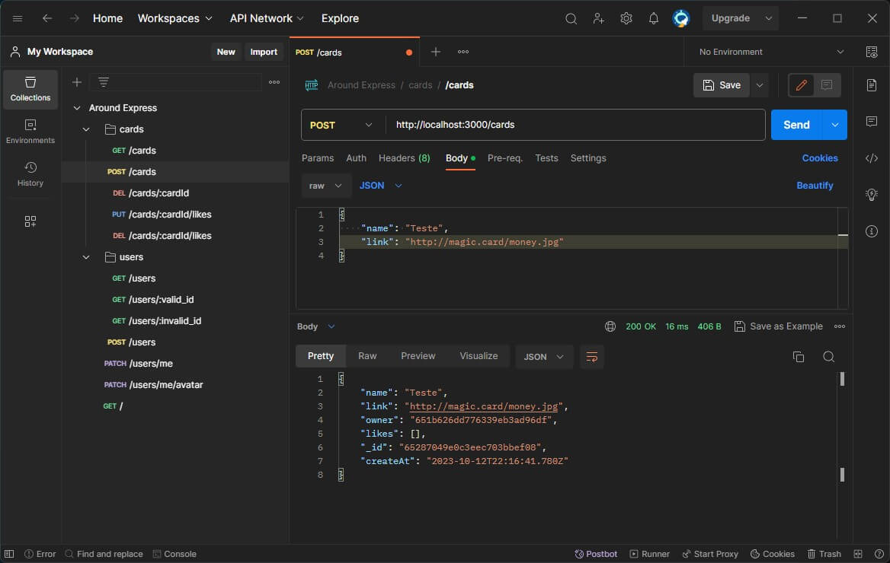
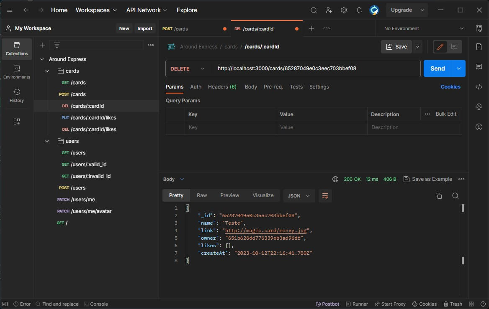

<!-- PROJECT LOGO -->
<br />
<div align="center" >
  <a href="https://github.com/github_username/repo_name">
    
  </a>

<h3 align="center">BACK-END</h3>

  <p align="center">
    TripleTen WebDev bootcamp project
  </p>
</div>

<!-- TABLE OF CONTENTS -->
<details>
  <summary>Table of Contents</summary>
  <ol>
    <li>
      <a href="#about-the-project">About The Project</a>
      <ul>
        <li><a href="#built-with">Built With</a></li>
      </ul>
    </li>
    <li>
      <a href="#getting-started">Getting Started</a>
      <ul>
        <li><a href="#prerequisites">Prerequisites</a></li>
        <li><a href="#installation">Installation</a></li>
      </ul>
    </li>
    <li><a href="#usage">Usage</a></li>
    <li><a href="#contributing">Contributing</a></li>
  </ol>
</details>

<!-- ABOUT THE PROJECT -->

## About The Project 

This project aims on the back-end side of "The Around U.S" WebApp. When fully coded, the server will be able to verify tokens, to save and to return cards and to remember if an user liked or not an given card. The hole objective is to create a server with an API and user autenthication.

In this project I had the oportunity to develop my knowledge with database, how to teste and cofigure validation and to deploy the server in a remote machine.

You can check my front-end version of the page made using React.js at [https://edu-fortes.github.io/around-react_ptbr/](https://edu-fortes.github.io/around-react_ptbr/)

### Built With

- [![NodeJS][NodeJS]][NodeJS-url]
- [![MongoDB][MongoDB]][MongoDB-url]
- [![Express][Express.js]][Express-url]
- [![Mongoose][Mongoose]][Mongoose-url]
- [![Postman][Postman]][Postman-url]

<!-- GETTING STARTED -->

## Getting Started

To get a local copy up and running follow these simple example steps.

### Prerequisites

- You will need an API client to make the required requests and visualize response. You can use [Postman](https://www.postman.com/) or [Insomnia](https://insomnia.rest/).



- MongoDB with a database conected on _'**mongodb://localhost:27017/**'_. You can install the MongoDB community version at [https://www.mongodb.com/try/download/community](https://www.mongodb.com/try/download/community)



- Node.js and Node Package Manager (npm). If not installed, follow the address to install it ([https://nodejs.org/en](https://nodejs.org/en)).

  To check if you have Node.js and NPM installed run the following in your terminal:

  - node

    ```sh
    node -v
    ```

    Expected to return your Node version.

  - npm
    ```sh
    npm -v
    ```
    Expected to return your NPM version.

### Installation

1. Fork this repo to your GitHub account
2. Clone the forked repo from your account
   ```sh
   git clone https://github.com/github_username/repo_name.git
   ```
3. Change to cloned folder
4. Install NPM packages dependencies
   ```sh
   npm install
   ```

<!-- USAGE -->

## Usage

To lauch the server execute:

```sh
npm run start
```

To lauch the server in development mode with the hot reload active, execute:

```sh
npm run dev
```

In either way, the server is going to lauch on port _3000_. Use _http://localhost:3000_ as base URL address to make HTTP requests using _Postman/Insomnia_.

### Endpoint to users:

`GET /users` - returns users document from MongoDB. First you need to create an user to populate this document, else it is going to return an error message.

`GET /users/:userId` - returns an user by ID. Replace `:userId` by user ID.



`POST /users` - creates a new user. Must pass a JSON on body request with `name` and `about`, like this:

    {
      "name": "Some name",
      "about": "Some work description",
    }



`PATCH /users/me` - updates profile. Pass a JSON body request with `name` and `about`.



`PATCH /users/me/avatar` - updates avatar. Pass a JSON body request with `avatar` containing an image URL:

    {
      "avatar": "http://YOUR__IMAGE__URL.com"
    }



### Endpoints to cards:

`GET /cards` - returns cards document from MongoDB. You need to create some cards to populate this document, else it is going to return an error message.



`POST /cards` - creates a new card. Pass a JSON body request with `name` and `link`:

    {
      "name": "Name of the card",
      "link": "https://URL__to__image.com"
    }



`DELETE /cards/:cardId`: deletes a card by ID. Replace `:cardId` with the card ID.



`PUT /cards/:cardId/likes` - like a card. Replace `:cardId` by card ID to be liked.

`DELETE /cards/:cardId/likes` - dislike a card. Replace `:cardId` by card ID to be dislike.

If something gets wrong with your request, is supposed to the server to return an HTTP status code and an error message in JSON format.

<!-- CONTRIBUTING -->

## Contributing

Contributions are what make the open source community such an amazing place to learn, inspire, and create. Any contributions you make are **greatly appreciated**.

If you have a suggestion that would make this better, please fork the repo and create a pull request. You can also simply open an issue with the tag "enhancement".
Don't forget to give the project a star! Thanks again!

1. Fork the Project

2. Create your Feature Branch

```sh
git checkout -b feature/AmazingFeature
```

3. Commit your Changes

```sh
git commit -m 'Add some AmazingFeature'
```

4. Push to the Branch

```sh
git push origin feature/AmazingFeature
```

5. Open a Pull Request

<p align="right">(<a href="#readme-top">back to top</a>)</p>

<!-- MARKDOWN LINKS & IMAGES -->
<!-- https://www.markdownguide.org/basic-syntax/#reference-style-links -->

[NodeJS]: https://img.shields.io/badge/node.js-6DA55F?style=for-the-badge&logo=node.js&logoColor=white
[NodeJS-url]: https://nodejs.org/en
[MongoDB]: https://img.shields.io/badge/MongoDB-%234ea94b.svg?style=for-the-badge&logo=mongodb&logoColor=white
[MongoDB-url]: https://www.mongodb.com/
[Express.js]: https://img.shields.io/badge/express.js-%23404d59.svg?style=for-the-badge&logo=express&logoColor=%2361DAFB
[Express-url]: https://expressjs.com/
[Mongoose]: https://img.shields.io/badge/Mongoose-880000.svg?style=for-the-badge&logo=Mongoose&logoColor=white
[Mongoose-url]: https://mongoosejs.com/
[Postman]: https://img.shields.io/badge/Postman-FF6C37.svg?style=for-the-badge&logo=Postman&logoColor=white
[Postman-url]: https://www.postman.com/
